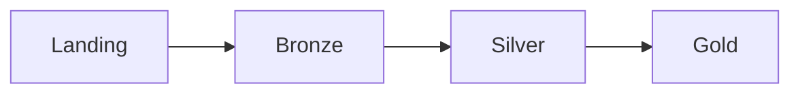

# Pipeline de Dados no Databricks — Medalhão (Automobile)

Este repositório organiza um pipeline ELT no Databricks baseado em notebooks ordenados, seguindo a arquitetura Medalhão (Landing -> Bronze -> Silver -> Gold) para o domínio de automóveis.

## Visão Geral
- Fluxo principal: `001 -> 002 -> 003 -> 004` e limpeza com `005`.
- Cada notebook é focado em uma camada do medalhão e é idealmente idempotente.
- A execução pode ser orquestrada por um Job do Databricks com tarefas encadeadas.

## Arquitetura (Medalhão)
- Landing: Área de chegada dos dados brutos (arquivos externos, streams, integrações).
- Bronze: Ingestão fiel do dado de Landing, com mínimo tratamento (auditabilidade).
- Silver: Limpeza, padronização, enriquecimento e modelagem para consumo analítico.
- Gold: Métricas, agregações e curadorias otimizadas para consumo de negócio.



## Estrutura do Projeto
```
notebooks/
  001_-environment-preparation.ipynb      # Preparação de ambiente e assets
  002_-landing_to_bronze_automobile.ipynb # Ingestão Landing -> Bronze (automobile)
  003_-bronze_to_silver_automobile.ipynb  # Transformação Bronze -> Silver (automobile)
  004_-silver_to_gold_automobile.ipynb    # Curadoria/Agrupações Silver -> Gold (automobile)
  005_-destroying-environment.ipynb       # Teardown/Limpeza de assets
```
## Estrutura do MKDocs
```
docs/
  arquitetura.md   # Arquitetura utilizada no projeto
  bronze.md        # Descrições da camada bronze
  silver.md        # Descrições da camada silver
  gold.md          # Descrições da camada gold
  index.md         # Página de início
  pipeline.md      # Pipeline dos dados
  fluxo.md         # Exemplificação dos fluxos entre as camadas
```


## Orquestração com Job do Databricks

| Ordem | Tarefa | Notebook |
|------:|--------|----------|
| 1 | environment_preparation | `notebooks/001_-environment-preparation.ipynb` |
| 2 | landing_to_bronze | `notebooks/002_-landing_to_bronze_automobile.ipynb` |
| 3 | bronze_to_silver | `notebooks/003_-bronze_to_silver_automobile.ipynb` |
| 4 | silver_to_gold | `notebooks/004_-silver_to_gold_automobile.ipynb` |
| 5 | destroying_environment | `notebooks/005_-destroying-environment.ipynb` |

## Boas Práticas adotadas
- Idempotência onde possível (reexecuções não devem corromper estado).
- Separação por camadas e domínio (`automobile`).
- Parametrização e variáveis de ambiente via widgets/`spark.conf`.
- Overwrite e operações destrutivas somente quando protegidas por parâmetros.

---
